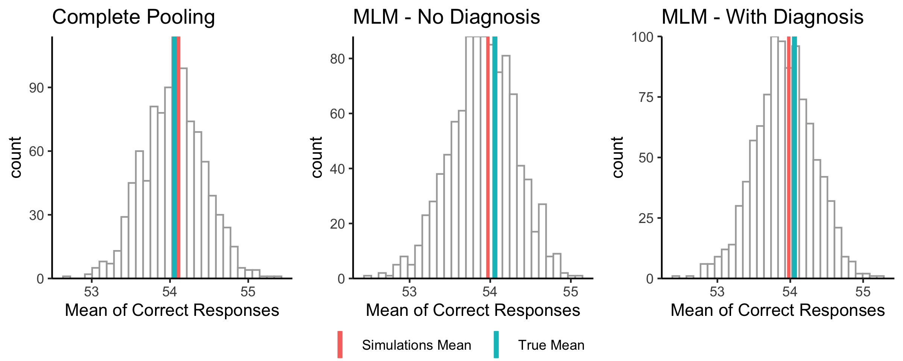
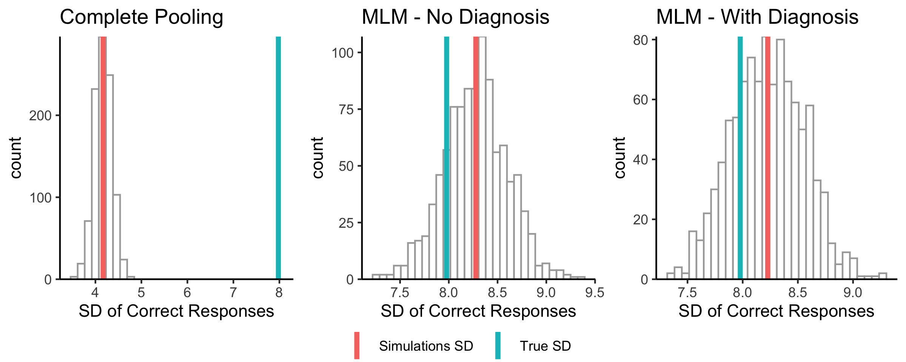

# Section 3
## Linear Models

```{r load_data, include=FALSE}
knitr::opts_chunk$set(warning = F, message = F)

library(tidyverse)
library(lme4)
library(tidybayes)

rm(list = ls())

color_pals <- RColorBrewer::brewer.pal(5, "Set1")
red <- color_pals[1]
blue <- color_pals[2]
green <- color_pals[3]
jit_pos <- position_jitter(width = 0.05, height = 0.02, seed = 42)


```

### Figure 1

```{r figure1, fig.height=3.7, fig.width=8}

df_models <- read.csv('data/output/linear_models_summary.csv')

pool_intercept <- df_models[df_models$Model == "Complete pooling",'Intercept'][1]
pool_slope <- df_models[df_models$Model == "Complete pooling",'Slope_Bin'][1]

df_models %>%
  filter(Model %in% c("Complete pooling")) %>%
  ggplot(aes(Bin, rater_score)) + 
  geom_point(alpha = 0.7, position = jit_pos) + 
  geom_abline(aes(intercept = Intercept, slope = Slope_Bin), color = color_pals[1], size = .75) + 
  theme_tidybayes() + 
  scale_y_continuous(labels = scales::percent) + 
  scale_x_continuous(labels = c("0-20", "21-40", "41-60", "61-80"))+#limits = c(0, 4)) + 
  labs(title = "Aggregate Regression - Complete Pooling", subtitle = "Elbow Dataset - Linear Learning",
       y = "Predicted Bin Score") -> pool_plot

df_models %>%
  filter(Model %in% c("No pooling")) %>%
  ggplot(aes(Bin, rater_score)) + 
  geom_abline(aes(intercept = Intercept, slope = Slope_Bin), color = color_pals[2], size = .5, alpha = 0.5) + 
  geom_point(alpha = 0.7, position = jit_pos) +
  geom_abline(aes(intercept = pool_intercept, slope = pool_slope), color = color_pals[1], size = 0.6)+
  theme_tidybayes() + 
  scale_y_continuous(labels = scales::percent) + 
  scale_x_continuous(labels = c("0-20", "21-40", "41-60", "61-80"))+ #limits = c(0, 4)) +
  labs(title = "Individual Regressions - No pooling",
       y = "Predicted Bin Score", 
       subtitle = "Elbow Dataset - Linear Learning") -> no_pool_plot

# Figure 1, 800*370
cowplot::plot_grid(pool_plot, no_pool_plot)
```

### Figure 2

```{r figure2, fig.height=3.7, fig.width=8}

df_models %>%
  filter(Model %in% c("Random Intercept")) %>%
  ggplot(aes(Bin, rater_score)) + 
  geom_abline(aes(intercept = Intercept, slope = Slope_Bin), color = color_pals[3], size = .65, alpha = 0.5) + 
  geom_point(alpha = 0.7, position = jit_pos) +
  geom_abline(aes(intercept = pool_intercept, slope = pool_slope), color = color_pals[1], size = 0.6)+
  theme_tidybayes() + 
  scale_y_continuous(labels = scales::percent) + 
  scale_x_continuous(labels = c("0-20", "21-40", "41-60", "61-80"))+ #limits = c(0, 4)) +
  labs(title = "Random Intercepts",
       y = "Predicted Bin Score",
       subtitle = "Elbow Dataset - Linear Learning") -> ri_plot

cowplot::plot_grid(no_pool_plot, ri_plot)


```

### Figure 3

```{r figure3, fig.height=3.7, fig.width=8}

df_models %>%
  filter(Model %in% c("Random Coefs")) %>%
  ggplot(aes(Bin, rater_score)) + 
  geom_abline(aes(intercept = Intercept, slope = Slope_Bin), color = color_pals[4], size = .65, alpha = 0.5) + 
  geom_point(alpha = 0.7, position = jit_pos) +
  geom_abline(aes(intercept = pool_intercept, slope = pool_slope), color = color_pals[1], size = 0.7)+
  theme_tidybayes() + 
  scale_y_continuous(labels = scales::percent) + 
  scale_x_continuous(labels = c("0-20", "21-40", "41-60", "61-80"))+ #limits = c(0, 4)) +
  labs(title = "Random Intercept and Slopes",
       y = "Predicted Bin Score", 
       subtitle = "Elbow Dataset - Linear Learning") -> rc_plot

cowplot::plot_grid(ri_plot, rc_plot)
```

### Figure 4

```{r}
elbowsBin <- readRDS("data/interim/train_elbows_bins.rds")
# Sort by score

sort_raters <- elbowsBin %>%
  group_by(RaterID) %>%
  summarise(total_score = mean(rater_score)) %>%
  arrange(desc(total_score)) %>%
  pull(RaterID)

# List of raters of interest for final table
selected_raters <- sort_raters[seq(1, 226, 27)][c(1:4,6:9)]

rater_subset <- df_models %>% 
  filter(RaterID %in% selected_raters) %>%
  mutate(ID = factor(RaterID, levels = selected_raters, labels = paste0("ID ", selected_raters)))

ggplot(rater_subset) + 
  aes(x = Bin, y = rater_score) + 
  # Set the color mapping in this layer so the points don't get a color
  geom_abline(aes(intercept = Intercept, slope = Slope_Bin, 
                  color = Model),
              size = .75) + 
  geom_point() +
  facet_wrap(~ ID, nrow = 2) +
  # labs(x = xlab, y = ylab) + 
  scale_y_continuous(labels = scales::percent) +
  scale_x_continuous(limits = c(0,4)) + 
  theme_tidybayes() +
  # Fix the color palette 
  scale_color_brewer(palette = "Set1") + 
  theme(legend.position = "none") + 
  labs(y = "Predicted Bin Score")
```

## Logistic Models
### Figure 5

```{r fig.width=9.5, fig.height=3.7}
df_models <- read.csv('data/output/logistic_models_summary.csv')
df_models %>%
  ggplot(aes(Sequence, Accuracy, group = RaterID)) +
  geom_smooth(method = "glm", method.args = list(family = binomial), se = F,
              size = 0.5, alpha =  0.5, color = color_pals[2]) +
  geom_smooth(method = "glm", method.args = list(family = binomial), se = F,
              group = 1, size = 0.5, alpha =  0.5, color = color_pals[1]) +
  # geom_point(alpha = 0.7, position = jit_pos) + 
  # geom_curve(aes(intercept = Intercept, slope = Slope_Seq), color = color_pals[1], size = .75) + 
  tidybayes::theme_tidybayes() + 
  scale_y_continuous(labels = scales::percent) + 
  # scale_x_continuous(labels = c("0-20", "21-40", "41-60", "61-80"))+#limits = c(0, 4)) + 
  labs(title = "Complete and No Pooling", 
       subtitle = "Elbow Dataset - Nonlinear Learning",
       y = "Probability of Correct Response") -> p1

df_models %>%
  filter(Model == "Random Intercept") %>%
  ggplot(aes(Sequence, Accuracy, group = RaterID)) +
  geom_line(aes(y = prob), color = green) +
  geom_smooth(method = "glm", method.args = list(family = binomial), se = F,
              group = 1, size = 0.5, alpha =  0.5, color = red) +
  # geom_point(alpha = 0.7, position = jit_pos) + 
  # geom_curve(aes(intercept = Intercept, slope = Slope_Seq), color = color_pals[1], size = .75) + 
  tidybayes::theme_tidybayes() + 
  scale_y_continuous(labels = scales::percent, limits = c(0, 1)) + 
  # scale_x_continuous(labels = c("0-20", "21-40", "41-60", "61-80"))+#limits = c(0, 4)) + 
  labs(title = "Random Intercept", 
       subtitle = "Elbow Dataset - Nonlinear Learning",
       y = "Probability of Correct Response") -> p2

df_models %>%
  filter(Model == "Random Coefs") %>%
  ggplot(aes(Sequence, Accuracy, group = RaterID)) +
  geom_line(aes(y = prob), color = color_pals[4]) +
  geom_smooth(method = "glm", method.args = list(family = binomial), se = F,
              group = 1, size = 0.5, alpha =  0.5, color = red) +
  # geom_point(alpha = 0.7, position = jit_pos) + 
  # geom_curve(aes(intercept = Intercept, slope = Slope_Seq), color = color_pals[1], size = .75) + 
  tidybayes::theme_tidybayes() + 
  scale_y_continuous(labels = scales::percent, limits = c(0, 1)) + 
  # scale_x_continuous(labels = c("0-20", "21-40", "41-60", "61-80"))+#limits = c(0, 4)) + 
  labs(title = "Random Intercept and Slopes", 
       subtitle = "Elbow Dataset - Nonlinear Learning",
       y = "Probability of Correct Response") -> p3

# Figure 5, 800*370
cowplot::plot_grid(p1, p2, p3, nrow = 1)
```

### Figure 6

**Elbow**

```{r icc-elbows, fig.height=5, fig.width=5}
test_info_elbows <- read.csv('data/output/1PL-elbows-ICC.csv')
ggplot(test_info_elbows, aes(x = theta, y = prob, group = reorder(item, diff, mean))) +
  geom_line(color = color_pals[2], alpha = 0.7) +
  scale_y_continuous(labels = scales::percent) +
  scale_x_continuous(breaks = -7:7, limits = c(-7, 7)) +
  labs(x = "Person ability", y = "Probability of correct response", colour = "Item",
       title = "Joint Item Characteristic Plot", subtitle = "Elbow Dataset") + 
  geom_segment(aes(y = 0.5, yend = 0.5, x = -Inf, xend = 4.156322), linetype = "dashed", alpha = 0.5, size = 0.2) +
  geom_segment(aes(y = -Inf, yend = 0.5, x = 4.156322, xend = 4.156322), linetype = "dashed", alpha = 0.5, size = 0.2) +
  tidybayes::theme_tidybayes()
```


**ECG**

```{r icc-ecg, fig.height=5, fig.width=5}
test_info_ecg <- read.csv('data/output/1PL-ecg-ICC.csv')
ggplot(test_info_ecg, aes(x = theta, y = prob, group = reorder(item, diff, mean))) + geom_line(color = blue, alpha = 0.7) +
  scale_y_continuous(labels = scales::percent) +
  scale_x_continuous(breaks = -6:6, limits = c(-6, 6)) +
  labs(x = "Person ability", y = "Probability of correct response", colour = "Item",
       title = "Joint Item Characteristic Plot", subtitle = "ECG Dataset")+
  tidybayes::theme_tidybayes()


```


### Figure 7a

```{r diff-dist-elbow, fig.width=8.5}
lltm_elbows <- readRDS('data/output/LLTM-elbows.rds')
# lltm_elbows$CaseDx <- factor(lltm_elbows$CaseDx, levels = lltm_data$CaseDx)
lltm_elbows  %>% 
  ggplot(aes(x = CaseDx, y = FE_dx + RE_item, fill = CaseDx)) + 
  geom_boxplot(alpha = 0.75, outlier.alpha = 0.5, outlier.size = 1) +
  geom_point(size = 2, alpha = 0.7, show.legend = F) +
  # geom_point(aes(y = FE_dx + logit)) + 
  geom_point(aes(y = FE_dx), shape = 18, size = 6, show.legend = F) +
  theme_tidybayes() +
  theme(axis.ticks.x = element_blank(), legend.text = element_text(size = 14),
        axis.text.x = element_blank(),
        axis.text = element_text(size = 15),
        axis.title = element_text(size = 17), title = element_text(size = 18)) +
  scale_fill_brewer(palette = "Paired") + 
  scale_y_continuous(limits = c(-4,4), breaks = seq(-4,4,1)) +
  labs(y = "Log of Odds of Accurate Response", x = "", 
       title = "Distributions of Difficulty by Diagnosis", 
       subtitle = "Elbow Dataset",
       fill = "Diagnosis")

```

### Figure 7b

```{r diff-dist-ecg, fig.width=8.5}
lltm_ecg <- readRDS('data/output/LLTM-ecg.rds')
lltm_ecg %>% 
  ggplot(aes(x = cardiologistDxLabel, y = FE_dx + RE_item, fill = cardiologistDxLabel)) + 
  geom_boxplot(alpha = 0.75, outlier.alpha = 0.5, outlier.size = 1) +
  geom_point(size = 2, alpha = 0.7, show.legend = F) +
  # geom_point(aes(y = FE_dx + logit)) + 
  geom_point(aes(y = FE_dx), shape = 18, size = 6, show.legend = F) +
  theme_tidybayes() + 
  theme(axis.ticks.x = element_blank(), 
        legend.text = element_text(size = 13),
        axis.text.x = element_blank(),
        axis.text = element_text(size = 15),
        axis.title = element_text(size = 17), 
        title = element_text(size = 18)) +
  scale_fill_brewer(palette = "Paired") + 
  scale_y_continuous(limits = c(-4, 4), breaks = seq(-4,4,1)) +
  labs(y = "Log of Odds of Accurate Response", x = "", 
       title = "Distributions of Difficulty by Diagnosis", 
       subtitle = "ECG Dataset",
       fill = "Diagnosis")

```


# Figure 9

```{r single_learning_curve, fig.height=5, fig.width=6}
elbows <- readRDS("data/interim/train_elbows.rds")
m2 <- readRDS('models/mlm_logistic_Dx.rds')
rater1 <- elbows[elbows$RaterID == 34,]
rater1$sclSeq <- rater1$Sequence/20
rater_plot <- cbind(rater1, merTools::predictInterval(m2, newdata = rater1, level = 0.95,
                                            n.sims=5000, type = 'probability',
                                            include.resid.var = F))

ggplot(data = rater_plot, aes(x = Sequence, y = fit, ymin = lwr, ymax = upr, color = CaseType2)) +
  geom_pointrange(alpha = 0.7) +
  scale_y_continuous(labels = scales::percent_format(accuracy = 1L)) +
  labs(y = "Probability of Correct Response", color = "Diagnosis",
       x = "Sequence",
       subtitle = paste0("Elbow Dataset - Learner ", 34)) + scale_color_brewer(palette = "Set2") +
  theme_classic() +
  theme(legend.position = "bottom", legend.title = element_blank(),
        legend.text = element_text(size = 14),
        axis.text = element_text(size = 14),
        axis.title = element_text(size = 15), title = element_text(size = 16))

```


## Model Evalutaion and Simulation

Test statistic: Mean and Standard Deviation of the Total Number of correct responses across all learners






